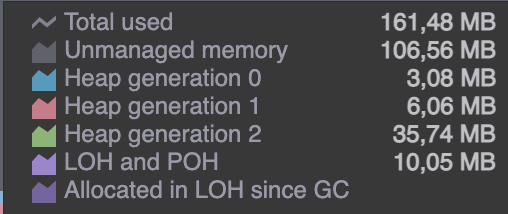

# iTextSharp

- [iTextSharp](#itextsharp)
  - [General](#general)
    - [References](#references)
  - [Notes](#notes)
    - [Concerns](#concerns)
      - [Memory consumption](#memory-consumption)
      - [Documentation](#documentation)
  - [Outcome](#outcome)

## General

IronPDF takes care of the difficult problem of adding PDF generation to your app, and automates turning formatted documents into a PDF.

- Convert web forms, local HTML pages, and other web pages to PDF with .NET
- Allow users to download documents, send them by email, or store them in the cloud.
- Produce invoices, quotes, reports, contracts, and other documents.
- Work with ASP.NET, ASP.NET Core, web forms, MVC, Web APIs on .NET Framework, and .NET Core.

> License: paid version - please see the [documentation](https://itextpdf.com/how-buy)

### References

- [Website](https://itextpdf.com/)
- [Sample code](https://github.com/itext/itext7-dotnet)

## Notes

- Converts HTML file/string/URL to PDF.
- Is able to save PDF to file or to Stream.
- Is able to work with images, Javascript and Charts.
- Provides support of Custom Fonts.
- Rich documentation with examples.
- Potentially more advanced support.

### Concerns

- Not an open-source.
- License cost.
- Not a great community: 211 results on stackoverflow.
- Bad documentation.
- Unknown memory leak.

#### Memory consumption

During memory efficiency testing, we have noticed that abnormally big amount of memory is consumed to transform simple document with a help of iText. Based on a memory dump, we can identify that the most allocated memory is unmanaged.

As this library does not require any assets to be preinstalled (like headless browser), we suppose that this is a result of `baked-in` binaries of conversion mechanism. At the same time, it is hard to exactly specify which mechanism is used and which binaries are required as iText uses some custom `engine`.

You can find more about its architecture:

- [Question about browser engine in iText](https://kb.itextpdf.com/home/it7kb/ebooks/itext-7-converting-html-to-pdf-with-pdfhtml/chapter-7-frequently-asked-questions-about-pdfhtml/do-we-need-a-browser-engine-to-render-html+css-to-pdf)
- [Architecture whitepaper](https://itextpdf.com/resources/media/files/pdfhtml-white-paper)
- [iText technical presentation](https://itextpdf.com/sites/default/files/2018-12/Introducing%20pdfHTML%20-%20technical%20presentation.pdf)

Due to a nature of custom engine for PDF generation, unavailability of documentation and open-source community, it is hard to define if this behavior is expected or it is a memory leak.

#### Documentation

During prototyping of a solution with a help of iText, we have faced an issue that exporting of PDF to a MemoryStream resulted in disposed object. To overcome this issue, we tried to visit GitHub of this project but besides small documentation it contained no information. Also GitHub issues were unavailable despite the code is open-source.

There is [Knowledge Base](https://kb.itextpdf.com/home) forum, that is should support developers in a form of questions-answers. Despite this is a common practice, answering is only available to iText workers, so the amount of information there is very limited.

As a result, we were not able to find a resolution of this issue with a help of documentation. This highlights a problem of "managed" approach - limited documentation and support available.

## Outcome

No major concerns besides license and generation from a string.
